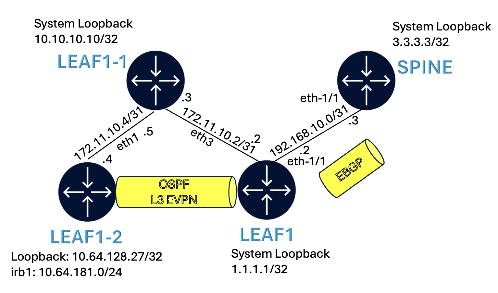

# Advertising EVPN Type 5 route over eBGP with MED set to IGP cost

---

**[Run](https://codespaces.new/sajusal/wm-med?quickstart=1) this lab in GitHub Codespaces for free**.  
[Learn more](https://containerlab.dev/manual/codespaces/) about Containerlab for Codespaces.

---

